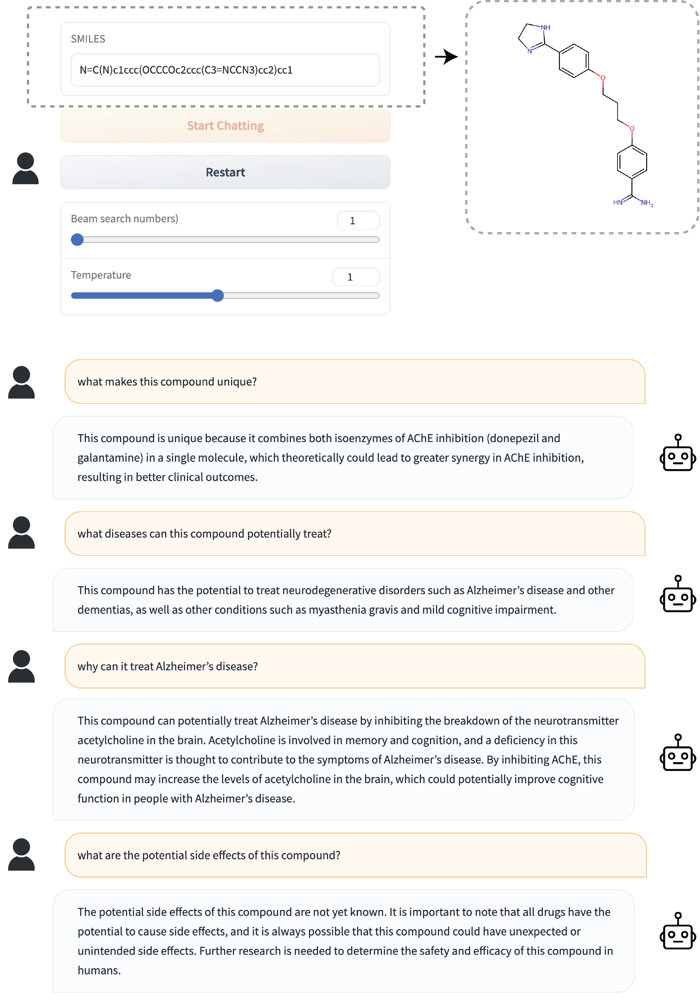

# DrugChat: Towards Enabling ChatGPT-Like Capabilities on Drug Molecule Graphs

This repository holds the code of DrugChat: Towards Enabling ChatGPT-Like Capabilities on Drug Molecule Graphs.


## Examples

 


## Introduction
- In this work, we make an initial attempt towards enabling ChatGPT-like capabilities on drug molecule graphs, by developing a prototype system DrugChat.
- DrugChat works in a similar way as ChatGPT. Users upload a compound molecule graph and ask various questions about this compound. DrugChat will answer these questions in a multi-turn, interactive manner. 
- The DrugChat system consists of a graph neural network (GNN), a large language model (LLM), and an adaptor. The GNN takes a compound molecule graph as input and learns a representation for this graph. The adaptor transforms the graph representation produced by the GNN  into another  representation that is acceptable to the  LLM. The LLM takes the compound representation transformed by the adaptor and users' questions about this compound as inputs and generates answers. All these components are trained end-to-end.
- To train DrugChat, we collected   instruction tuning datasets which contain 10,834 drug compounds and 143,517 question-answer pairs.


## Datasets

The file data/ChEMBL_QA.json and data/PubChem_QA.json contains data for the ChEMBL Drug Instruction Tuning Dataset and the PubChem Drug Instruction Tuning Dataset. The data structure is as follows. 

{SMILES String: [ [Question1 , Answer1], [Question2 , Answer2]... ] }

## Disclaimer.  

This is a prototype system that has not been systematically and comprehensively validated by pharmaceutical experts yet. Please use with caution. 

Trained models and demo websites will be released after we thoroughly validate the system with pharmaceutical experts.

## Citation

If you're using DrugChat in your research or applications, please cite using this BibTeX:
```bibtex
@article{liang2023drugchat,
  title={DrugChat: Towards Enabling ChatGPT-Like Capabilities on Drug Molecule Graphs},
  author={Liang, Youwei and Zhang, Ruiyi and Zhang, li and Xie, Pengtao},
  journal={arXiv preprint arXiv:xxxx.xxxxx},
  year={2023}
}
```